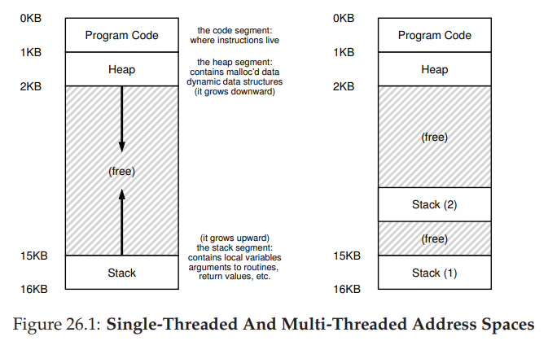

## Multi Thread 필요 이유
### 가장 큰 이유는 성능과 응답성을 위함
### 멀티 스레딩을 사용 시 여러 사용자를 동시에 수용이 가능
### 각각의 스레드가 각자의 요청을 처리, 사용자 인터페이스가 있는 웹은 응답성이 매우 중요
### 코어 하나 만 으로도 반응형 애플리케이션을 만들 수 있으므 병행성을 이요하면 하나의 코어만으로도 구현이 가능
### 컴퓨터를 켜면 운영 체제 프로그램이 디스크에서 메모리로 로드 됨, 운영 체제는 어플리케이션 개발자 ㅜ일대신
### 하드웨어 CPU 상호 작용을 도움

### 처음에는 프로그램들 (ex. 메모장, 음악파일 등) 모두 Hard Disk 에 파일 형태로 저장 되어 있지만 실행을 하면
### 프로그램을 메모리에 로드, 프로그램의 인스턴스를 생성, 이 인스턴스를 프로세스라고 함

### 각 프로세스는 시스템에서 실행되는 다른 프로세스와는 완전히 별개임,
### Process 에는 PID 가 있는 데 PID 는 어플리케이션이 읽고 쓰기 위해 여는 파일임
### 코드는 CPU 에서 실행되는 명령, 힙에는 어플리케이션에 필요한 모든 데이터가 있음
### Heap 에는 어플리케이션에 필요한 모든 데이터가 들어 있음
### Main Thread 라고 불리는 Thread 가 최소한 하나가 있음
### Thread 는 크게 두 가지를 가지고 있음, 스택과 명령어 포인트임
### Multi Thread 어플리케이션에서는 각각의 스레드는 자체 스택과 명령어 포인트를 가지지만
### 프로세스 내의 나머지 컴포넌트는 모든 스레드가 공유

### Stack - 스택은 메모리 용영 지역 변수가 저장 되고 기능이 실행되는 영영
### 명령어 포인터는 그냥 포인터임, 스레드가 실행 된 다음 다음 명령어의 주소를 가리킴
### 각각의 스레드가 자체 스택과 명령어 포인터를 가지는 이유는 쉽게 이해하려면 각각의 스레드는 특정 순간에
### 서로 다른 함수를 이용 해 다른 명령을 수행

- Thread 가 독립적으로 가지는 것
  - Stack
  - Instruction Pointer
- Thread 들 끼리 공유하는 것
  - Files
  - Heap
  - Code

### 서로 관련이 없는 작업을 실행 할 경우 같은 프로세스에 통합하는 건 아무 의미가 없음
### 일반적으로 코어보다는 프로세스가 훨씬 많음, 각각의 프로세스는 하나 이상의 Thread 를 가짐
### 모든 스레드는 CPU 실행을 두고 서로 경쟁을 함, 코어가 여러개라 하더라도 Thread 가 Core 보다 많음

### Context Switch - 어플리케이션의 각각의 인스턴스는 다른 프로세스와 독립적으로 실행, 
### Thread Scheduling - 
### Thread VS Process -

## 
